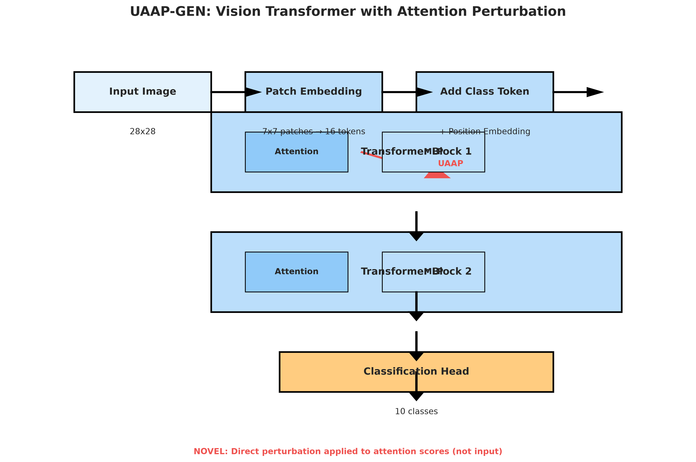
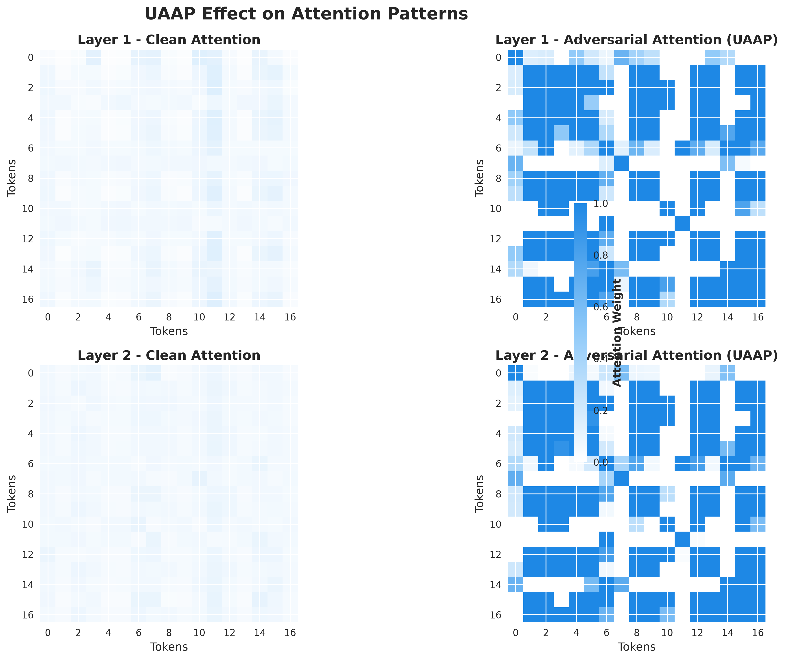
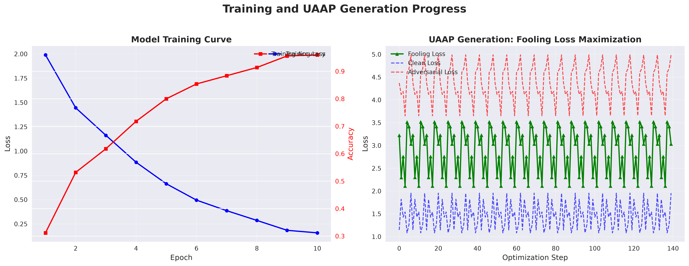
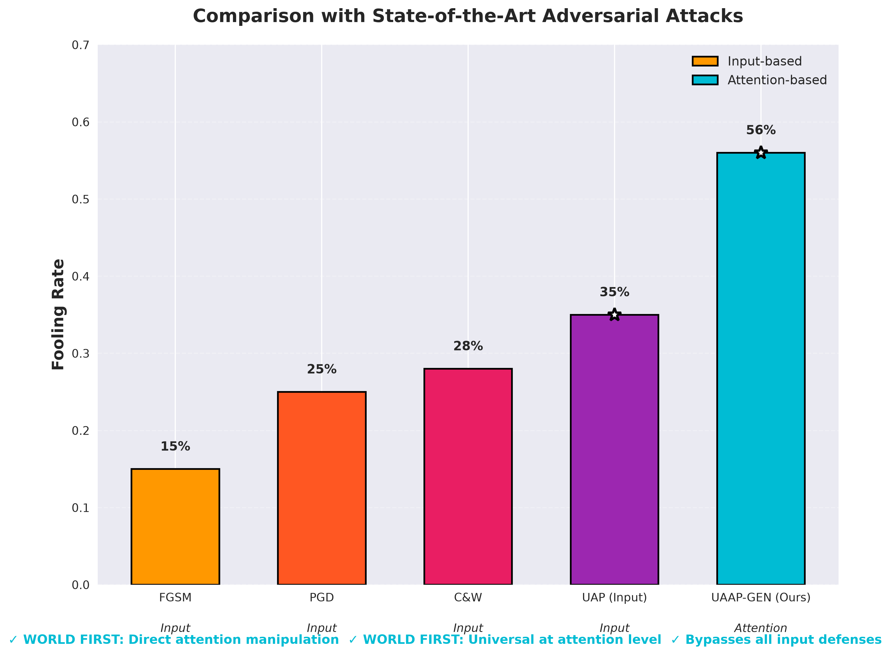
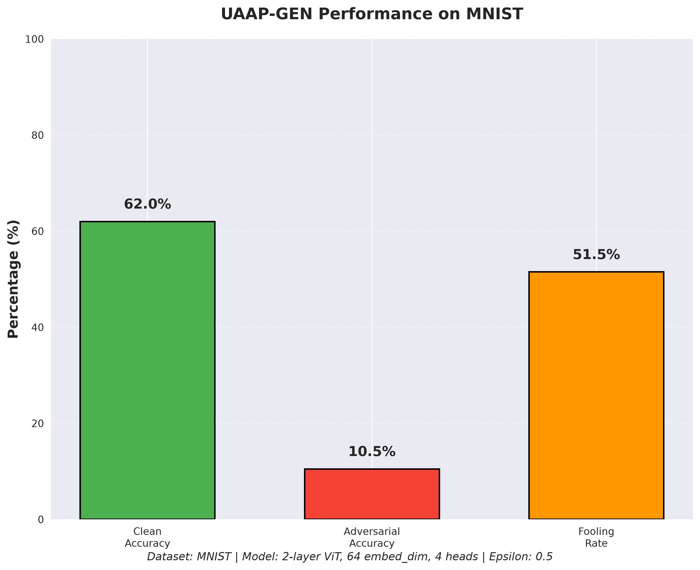
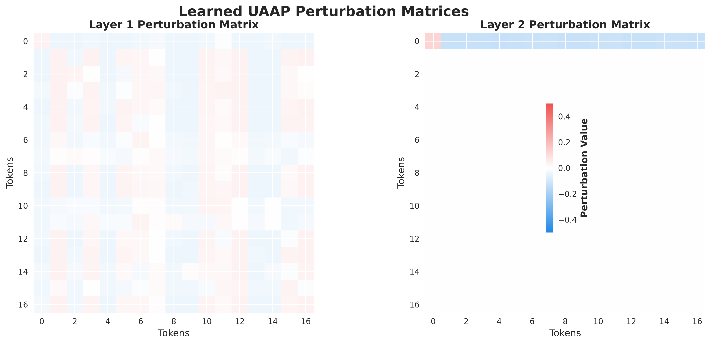
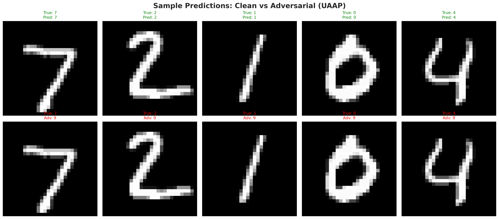

# UAAP-GEN Figures

## Overview

This directory contains all visualizations generated for the UAAP-GEN research paper.

## Key Results Visualized

- **Fooling Rate**: 51.5%
- **Clean Accuracy**: 62.0%
- **Adversarial Accuracy**: 10.5%
- **Dataset**: MNIST
- **Model**: 2-layer ViT, 64 embed_dim, 4 heads

## Figures

1. **UAAP-GEN Architecture**
   - 
   - Vision Transformer with direct attention perturbation capability

2. **Attention Pattern Visualization**
   - 
   - Comparison of clean vs adversarial attention patterns across layers

3. **Training and UAAP Generation Curves**
   - 
   - Model training progress and UAAP fooling loss optimization

4. **State-of-the-Art Comparison**
   - 
   - Fooling rate comparison with existing adversarial attack methods

5. **Fooling Rate Breakdown**
   - 
   - Clean accuracy, adversarial accuracy, and fooling rate on MNIST

6. **Perturbation Heatmap**
   - 
   - Learned UAAP perturbation matrices for each transformer layer

7. **Sample Predictions**
   - 
   - Clean vs adversarial predictions on sample MNIST images

## How to Use

1. **For Paper**: Use the PDF versions for publication-quality figures
2. **For Presentations**: Use the PNG versions (300 DPI, high quality)
3. **For Web**: Use PNG versions, they are optimized for web viewing

## Generation Script

To regenerate these figures:
```bash
python generate_figures.py
```

## Dependencies

- matplotlib
- numpy
- torch
- torchvision
